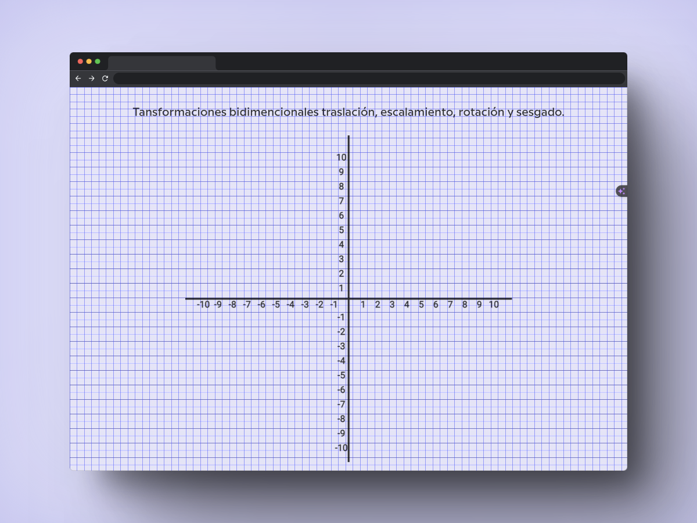

# 📈Transformaciones-2D 📉

 ## Introduction
Welcome to the Transformaciones 2D repository! This project is a collection of algorithms and tools for performing 2D transformations using HTML5 Canvas.

## Technologies

* HTML
* CSS
* JS

<!-- JavaScript Icon -->

  
   
  
   
  
  
  
  

  

## Features
* Algorithms for performing 2D transformations, such as translation, rotation, and scaling.
* Intuitive user interface for interacting with the algorithms and visualizing the results.
* Well-documented and easy-to-understand code.

# Design 🎨

  

## Resourses

* [backgrund generator ](https://www.magicpattern.design/tools/css-backgrounds)

Thank you for visiting this repository! We hope you enjoy using Transformaciones 2D. 😊

 

